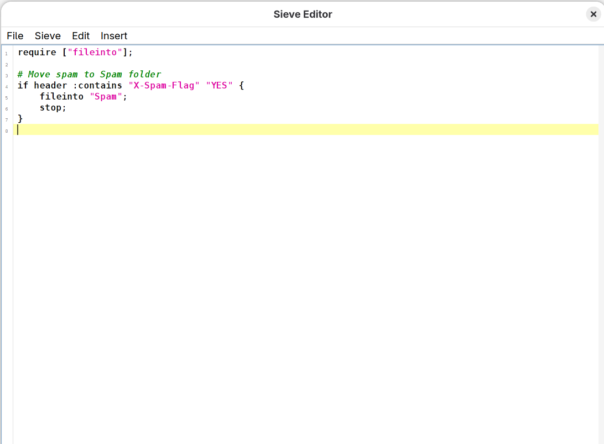
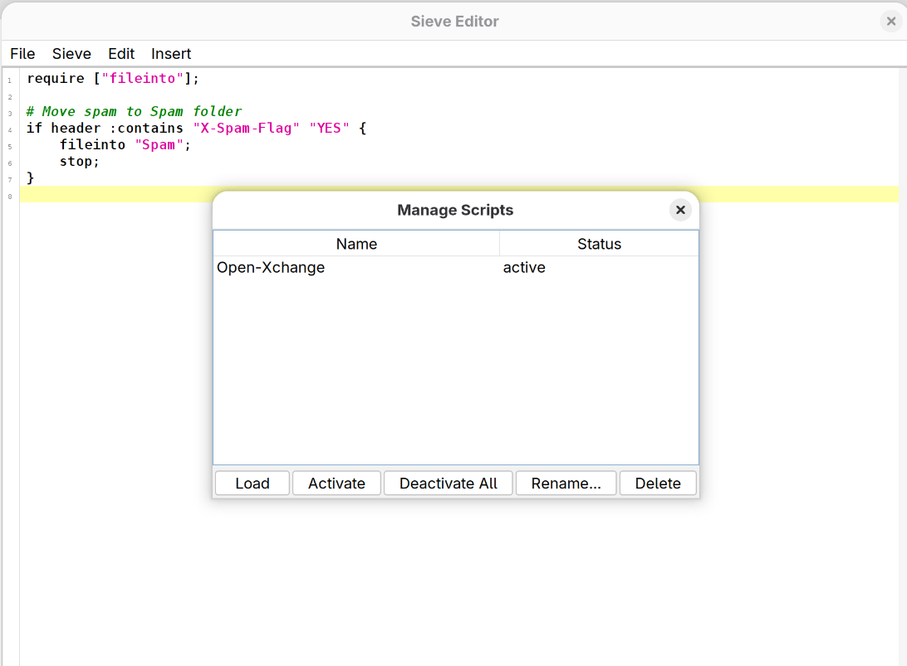
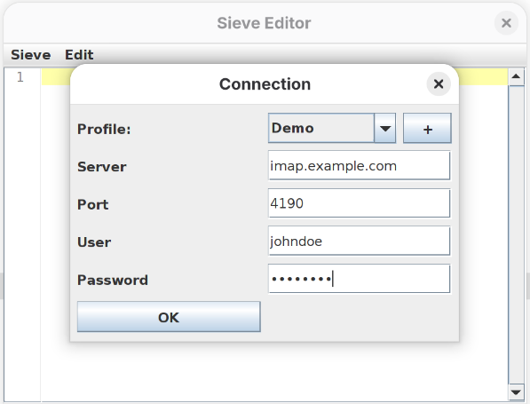
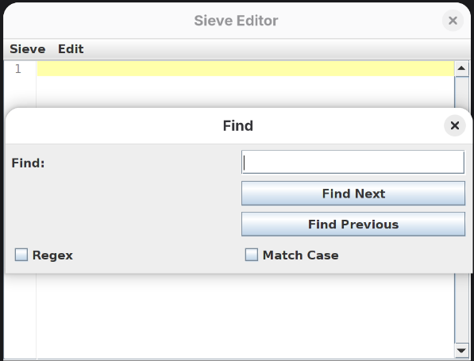
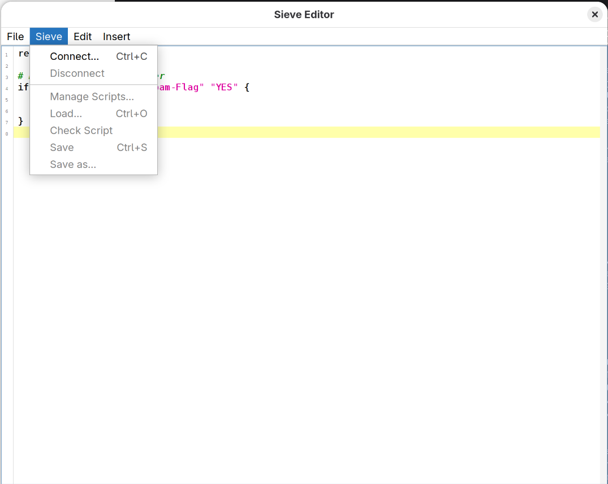
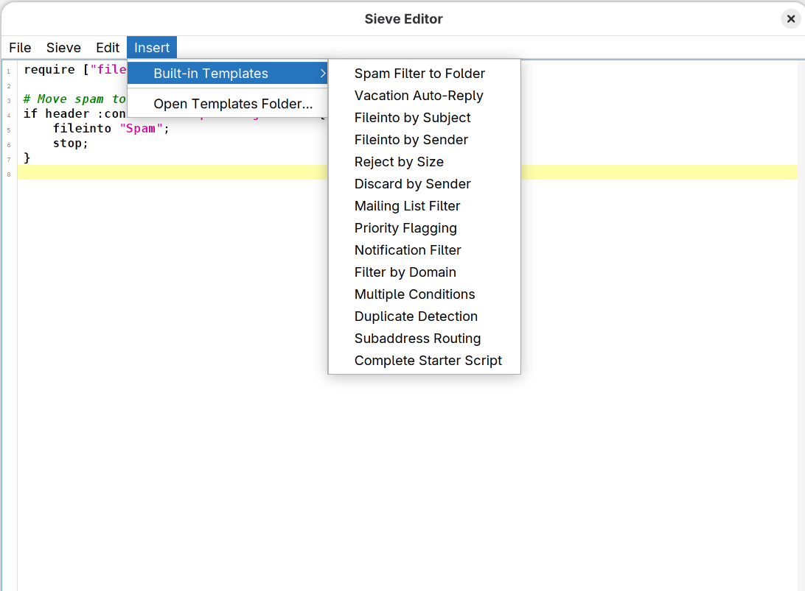
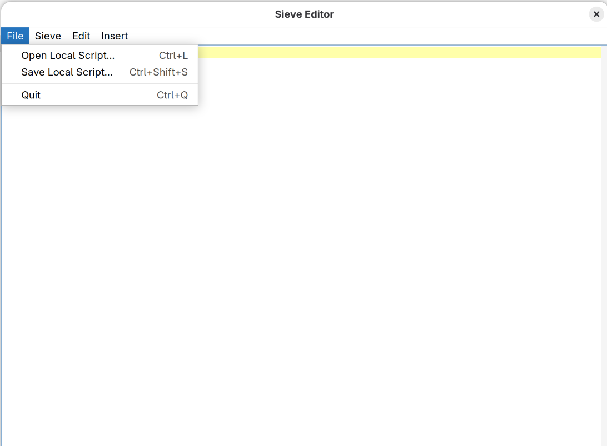
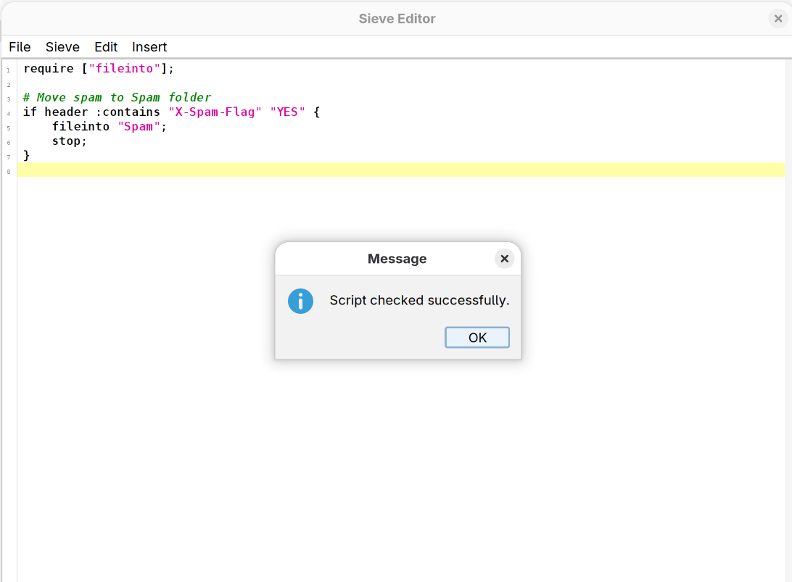

# SieveEditor

[](https://app.fossa.com/projects/git%2Bgithub.com%2Flenucksi%2FSieveEditor?ref=badge_shield)

A desktop editor for Sieve mail filter scripts on ManageSieve-compatible servers.

## Screenshots

<details>
<summary>View Screenshots</summary>

### Main Window



### Script Management



### Connection Dialog



### Search and Replace



### Sieve Menu



### Template Menu



### Local Operations Menu



### Script Validation



</details>

## Building from Source

### Prerequisites

- Java 21 LTS or later
- Maven 3.6+
- Git

### Clone

```bash
git clone https://github.com/lenucksi/SieveEditor.git
cd SieveEditor
```

### Build

Build using Maven:

```bash
mvn clean package
```

This will create `target/SieveEditor-jar-with-dependencies.jar`

### Run

```bash
java -jar target/SieveEditor-jar-with-dependencies.jar
```

## Features

- Multiple account profiles support
- Syntax highlighting for Sieve scripts
- Find/Replace functionality
- HiDPI/4K display support
- Script validation
- Direct server connection via ManageSieve protocol
- **Local file editing** - Open/save .sieve files locally (Ctrl+L / Ctrl+Shift+S)
- **Template insertion** - Built-in templates for common Sieve patterns

## Documentation

- [CONTRIBUTING.md](CONTRIBUTING.md) - Contributing guidelines and development workflow
- [README-TESTS.md](README-TESTS.md) - Test infrastructure and coverage
- [SECURITY.md](SECURITY.md) - Security policy and vulnerability reporting

## Known Issues

### Mouse Button 4/5 Exceptions on Linux (X11)

**Issue:** When using horizontal scroll wheel (tilt wheel), you may see warnings in the console:

```text
java.lang.IllegalArgumentException: Nonexistent button 4/5
    at java.desktop/java.awt.event.MouseEvent.<init>(MouseEvent.java:774)
    at java.desktop/sun.awt.X11.XWindow.handleButtonPressRelease(XWindow.java:749)
```

**Cause:** This is a known JDK bug in the X11 AWT backend ([JDK-8372756](https://bugs.openjdk.org/browse/JDK-8372756), [JDK-8033000](https://bugs.openjdk.org/browse/JDK-8033000), [JDK-6440198](https://bugs.openjdk.org/browse/JDK-6440198)). X11 reports mouse buttons 4-7 for scroll wheel events, but Java's MouseEvent only accepts buttons 0-3. The exception occurs in native code before Java can intercept it.

**Impact:** These are harmless warnings that don't affect functionality. You can safely ignore them.

**Workaround:** To suppress the warnings (note: this doesn't enable horizontal scrolling), add this JVM parameter when running:

```bash
java -Dsun.awt.xembedserver=true -jar target/SieveEditor-jar-with-dependencies.jar
```

**Status:** This cannot be fixed at the application level - it requires a JDK patch. The issue has been reported to OpenJDK but remains unfixed as of Java 21.

## Important

No support or guarantees for function, safety or security of any sorts.
Expect that this software will kill your dog and eat it. There will be bugs. It will likely not be fit for the purpose you intend to use it for. You might loose data, passwords or encounter security incidents.

It is explicitly forbidden to use it for any purpose that would be, direct or indirectly, be connected to anything that would be related to safety or security of building, entity, machinery, human life, etc. You have been warned; use at your own risk.

## License

[](https://app.fossa.com/projects/git%2Bgithub.com%2Flenucksi%2FSieveEditor?ref=badge_large)
